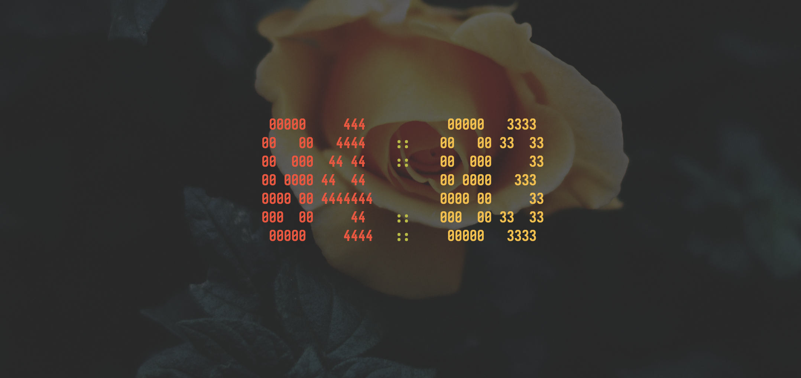

# m_countdown

## Author
    Manuel Pardo Pose

## What is this?
    This is a CLI Application that provides a customizable countdown
    which is supposed to be lightweight and presentable.

## Screenshots

## How to build:
#### First:

    cd m_countdown

#### Then:

    cargo run --

or

    cargo run -- -h

or

    cargo run -- -m 4 -s 20 -b --col1 191,97,106 --col2 163,190,188 --col3 180,142,173 -v 3,1 -c 2

## Explanation of Parameters
|Flag               |Description                                    |
|:-                 |:-                                             |
|-m / --min         |Sets the amount of minutes the timer starts at |
|-s / --sec         |Sets the amount of seconds the timer starts at |
|-b / --bounce      |If set to true the counter will bounce         |
|--col1             |Sets the rgb value of the counters left part   |
|--col2             |Sets the rgb value of the counters middle part |
|--col3             |Sets the rgb value of the counters right part  |
|-v / --vel         |Sets the velocity vector of the counter        |
|-c / --char-style  |Sets the drawing style of the counter          |
|-h / --help        |Prints help for the commands                   |
